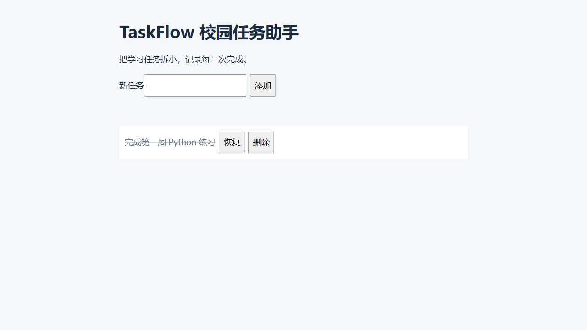

# 运行验证记录

验证日期：2026年10月3日。记录实际执行结果，自动检查与学生试学分别记录。

## 已执行的本地检查

| 检查 | 结果与范围 |
|---|---|
| 课程目录 | 63个条目；32课基础必修合计96小时；四方向各72小时课程及24小时项目；先修无环、路径存在、配套齐全 |
| 迁移清单 | 922个原文件全部有唯一去向；297项原内容保留并核对SHA256，包括7份二进制资源；UTF-8保留文本另有换行规范化哈希，文本改动保留原始哈希 |
| Markdown本地链接 | 1150个本地目标检查通过，均存在且位于仓库内；不检查网络可达性及标题锚点 |
| Python语法 | 全部337份Python文件解析通过，包括历史材料；语法通过不代表全部进阶实验已运行 |
| 基础课程运行 | 32份示例及32份参考答案，共64次；答案输出与练习说明一致；在中文和空格临时路径执行 |
| 离线项目 | 8项测试通过；覆盖输入契约、JSON损坏保留、SQLite参数化与重启、检索来源及无依据行为、CSV校验、训练测试分离 |
| Django项目 | 系统检查通过、模型与迁移一致；4项测试通过，包含任务完整流程、坏输入、缺失编号、CSRF与健康检查 |
| 浏览器实际操作 | 空输入提示、添加、完成、刷新后保留、删除均通过；测试数据已清理 |

统一复现命令（从仓库根目录执行；Django解释器需已安装项目requirements.txt）：

```powershell
python "工具脚本/验证课程.py" --django-python "已安装Django依赖的Python完整路径"
```

仅运行标准库检查时可省略`--django-python`，此时Django结果明确标记为未运行。

网页实际验证截图显示任务完成后刷新仍然保留：



## 验证环境

本地为Windows、Python 3.11.9。Django 5.2.17、asgiref 3.12.1、sqlparse 0.6.0、tzdata 2026.4固定在项目requirements.txt，验证时使用独立虚拟环境。基础和离线项目只使用Python标准库，不依赖作者已有数据或虚拟环境。

## 远端自动检查

首轮[远端检查](https://github.com/ymyymy27/pom-lesson/actions/runs/37114157300)中，Windows、Ubuntu的完整Python验证均通过。Flutter 3.47.6在中文工程目录执行`flutter analyze`时出现分析器协议解析错误，尚未进入测试或构建。新增验证脚本把源码复制到临时英文路径后运行全部步骤，并固定SDK版本；修复后的执行结果继续补记。

提交分支推送到当前账号的Fork：`ymyymy27/pom-lesson`，分支为`codex/beginner-curriculum-restructure`。原仓库`pompeiiking/pom-lesson`对当前账号只有读取权限，直接推送返回403。

## 需要实际试学或专用环境的事项

真实学生试学尚未进行，课程使用“可试学”而非“已验证”。Flutter本机暂无SDK，源码、单元测试和Widget测试已提供，远端结果单独记录。历史参考中的外部API、GPU模型和服务实验需在对应环境逐课复现，未计入已运行范围。
